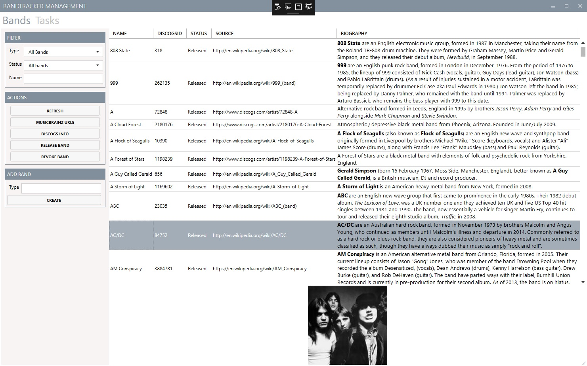

# BandTracker Management Interface

A management application for [BandTracker](https://github.com/JohanSmet/bandtracker), an app I developed as part of the Udacity iOS Developer NanoDegree I completed in 2015. During the NanoDegree I mostly used a MongoDB frontend to manage to limited dataset. But afterwards, while working on the android version, I decided to invest some time in a tool to make managing the available band and tour date information easier.

It ended up as a C#/WPF application, following the MVVM-model. The reasoning behind this was rather simple: I had already done a (small) QT application, there was no real reason to make it multi-platform and at the time at work we were moving to C#/WPF and I wanted to experiment with it a bit. 